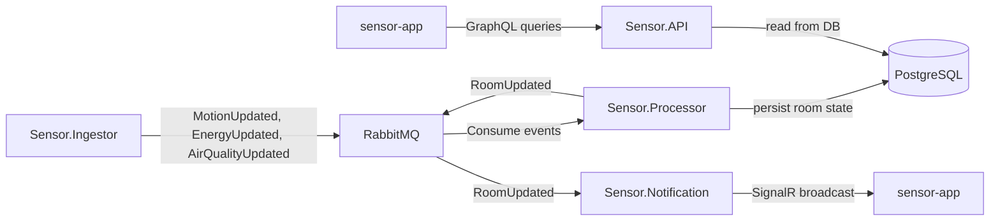

# Sensor Domain

## Overview

This repo contains a distributed sensor platform with the following services:

- `Sensor.API` - GraphQL API for reading room and sensor data.
- `Sensor.Ingestor` - publishes raw sensor events to RabbitMQ.
- `Sensor.Processor` - consumes sensor events, updates the database, and emits room notifications.
- `Sensor.Notification` - consumes room notification events and broadcasts them over SignalR.
- `sensor-app` - frontend application that reads data from `Sensor.API` and may subscribe to real-time updates.

## Data flow



## Service responsibilities

### Sensor.Ingestor

- Reads or simulates incoming sensor data.
- Publishes messages to RabbitMQ for:
  - `MotionUpdated`
  - `EnergyUpdated`
  - `AirQualityUpdated`
- Uses `RabbitMq` settings from appsettings or environment variables.

### Sensor.Processor

- Subscribes to sensor events from RabbitMQ.
- Writes or updates `RoomEntity` state in PostgreSQL.
- Publishes `RoomUpdated` notifications after processing each event.

### Sensor.Notification

- Subscribes to `RoomUpdated` events from RabbitMQ.
- Broadcasts notifications to clients using SignalR hub: `/roomNotification`.

### Sensor.API

- Exposes a GraphQL endpoint at `/graphql`.
- Query types include room data, motion, energy, and air quality.
- Reads persisted room data from PostgreSQL via business logic.

### sensor-app

- Frontend client built with React + Vite.
- Resolves GraphQL endpoint from `VITE_GRAPHQL_URL`.
- Default fallback is `/graphql`.

## Deployment / Docker Compose

The root `docker-compose.yml` defines the local runtime environment:

- `rabbitmq` - RabbitMQ broker with management UI exposed on `localhost:15672`.
- `sensor-api` - API service.
- `sensor-ingestor` - event producer.
- `sensor-notification` - notification broadcaster.
- `sensor-processor` - processor service.
- `sensor-frontend` - web UI.

### Important hostnames inside Docker network

- RabbitMQ: `rabbitmq:5672`
- API service: `sensor-api:8080`
- Frontend: `http://localhost:3000`

### Example Docker Compose environment values

- `VITE_GRAPHQL_URL=http://sensor-api:8080/graphql`
- `RabbitMq__Host=rabbitmq`
- `RabbitMq__VirtualHost=/`
- `RabbitMq__Username=guest`
- `RabbitMq__Password=guest`

## Configuration

Each service supports configuration from:

1. `appsettings.json`
2. `appsettings.Development.json`
3. Environment variables (Docker Compose variables override appsettings)

For Docker-based service connection strings, use `host.docker.internal` if the database is running on the host machine.

### Local PostgreSQL connection string example

```text
Host=localhost;Port=5432;Database=SensorDb;Username=postgres;Password=postgres
```

### Recommended Docker Compose override

```text
ConnectionStrings__PostgreSqlConnection=Host=host.docker.internal;Port=5432;Database=SensorDb;Username=postgres;Password=postgres
```

## Startup

From repo root:

```powershell
docker compose up --build
```

Then open:

- Frontend: `http://localhost:3000`
- API GraphQL: `http://localhost:5266/graphql`
- RabbitMQ UI: `http://localhost:15672`

## Notes

- `Sensor.Notification` exposes SignalR hub at `/roomNotification`.
- `Sensor.API` does not directly publish RabbitMQ events; it is a read/query service.
- `Sensor.Processor` is the main service that transforms raw sensor events into stored room state and notification events.
